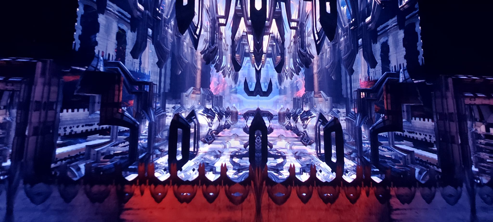

# Week 9: Next museum - Foreign Nature
## Foreign Nature - Julius Horsthuis

Voor de weekly nerd ben ik naar de Next museum gegaan. Daar wordt er  verschillende kunstwerken tentoongesteld  die gemaakt zijn met de technologie, de web en kunst. Er waren in totaal zes tentoonstelling die  allemaal verschillende onderwerpen hadden.  Als opdracht moest ik een kunstwerk kiezen en een technische analyse maken. Wat mij aan spreekt was het werk van Julius HorstHuis, Foreign Nature.

### Overzicht
Julius horsthuis is een digitale ontwerper die fractal formules gebruikt in zijn werk. Een van zijn werk was te zien in de Next Museum. Het heet Foreign Nature. Foreign Nature  bestaat uit verschillende patronen uit het natuur met wiskundige formules. Al deze patronen vormen een bovennatuurlijk landschap. Maar er zijn ook landschappen die we van het natuur en de wereld herkennen zoals patronen van gebouwen, insecten maar ook voor aliens. 

Het kunstwerk is een grote installatie die de hele kamer overneemt. De patronen zijn geprojecteerd op alle kanten van de zaal. Ook op de vloer. Het geef je een gevoel van desoriëntatie. In de achtergrond hoor je een zachte muziek om mee te leven in de ervaring. 

Dit was een korte beschrijving van de tentoonstelling.
 
### Technische analyse
Zoals ik al benoemde is Foreign Nature  gemaakt met Fractale geometrie. Fractale geommetrie zijn wiskundige formules die verschillende organische en abstracte patronen creërt. De Fractals is gemaakt met Mandelbulb 3D software. Het is  een 3D programma waar je verschillende 3D  beelden genereert.  De mandelbulb programma is een combinatie van frontend en backend. De frontend is de user interface waar gebuikers de programma bedient. En de backend bestaat uit complexe algoritme om 3d fractals te genereren. Er wordt daarnaast een techniek ray tracing. Ray tracing is een rendering techniek dat licht simuleert in  een virtuele omgeving, dus het zorgt voor realisische schaduwen en reflecties.

### Analyse van het ontwerp
De tentoonstelling is geprojecteerd in een grote zaal van  boven naar beneden. Het vormt een virtuele 3D omgeving.  Bij de ingang  staat een bord met de algemene informatie over de kunstwerk. Het geeft de kijkers  een context over de gedachtegang van de ontwerper.  Er is niet perse een directe vorm van interactie met de tentoonstelling.  maar omdat het op alle kanten te zien is heb je wel een gevoel dat je in dat wereld bent. De patronen verandert elke keer naar een andere landschap en ze bewegen naar voren toe. Deze beweging. Versterkt het gevoeld dat je in die omgeving leeft. Er wordt ook gebruikt gemaakt van geluiden om  een bovennatuurlijke sfeer te creëren.

### Reflectie
Foreign Nature is een 3D wereld met geneerderde patroneren van wiskundige patronen. Ik ben tot de conclusie gekomen dat je kan experimenteren met alle soorten technieken om je idee te vormgeven. Je kan abstracte middelen zoals wiskundige formules om iets heel organisch en menselijks te creëren.