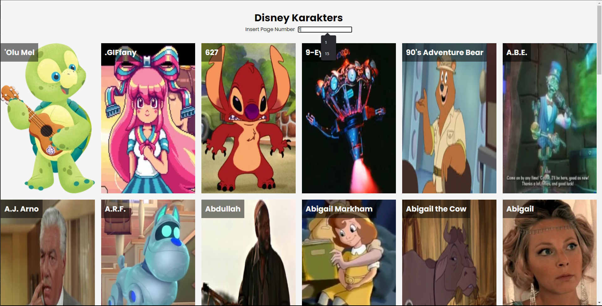

# Fetch Api gebruiken

## Fetch API
De Fetch API is een moderne vervanging voor XMLHttpRequest. Het is een op beloftes gebaseerde web-API die een responsobject teruggeeft. Het antwoordobject heeft een methode genaamd json() die een belofte teruggeeft. Deze belofte wordt opgelost met de JSON-gegevens uit de respons.


## Parameter van de fetch API

### Argument 1: De Rest API Endpoint
Om iets van het netwerk op te halen, moet je de methode "fetch()" gebruiken. Deze methode neemt één belangrijke parameter, namelijk het pad naar de bron die je wilt ophalen. Het pad kan een relatief of een absoluut pad zijn. Dus de request object. Vervolgens geeft fetch() een belofte terug die naar het `response` object verwijst. 

De tweede argument die de fetch methode kan hebben is een object met opties oftewel `options`. De opties zijn onder andere de methode, headers en body. 

### Argument 2:  Options

- Method: de HTTP-methode om het verzoek uit te voeren. Staat standaard op 'GET'.
- Body: de body van het HTTP-verzoek
- headers: een object met de headers die aan het verzoek moeten worden toegevoegd

Meestal worden de options opgeslagen in een variabele.

### Methode 
Met de fetch APi kun je verschillende methodes gebruiken, namelijk GET, POST, PUT, DELETE. De standaard methode is GET. 
    
```javascript
    fetch('https://jsonplaceholder.typicode.com/todos/1', {
      method: 'POST',
      body: JSON.stringify({
        title: 'foo',
        body: 'bar',
        userId: 1
      }),
      headers: {
        'Content-type': 'application/json; charset=UTF-8',
      },
    })
    .then((response) => response.json())
    .then((json) => console.log(json));
```


### Body
De body is een object met de data die je wilt versturen. Meestal is de Body een JSON object. 

   

### Headers
De Headers object zijn extra metadata die je meestuurt met het verzoek. Die aangeeft wat voor soort data je stuurt. Ook word meestal api key meegegeven. Om de het verzoek te authenticeren. 

```javascript
    fetch('https://jsonplaceholder.typicode.com/todos/1', {
     
      headers: {
        'Content-type': 'application/json; charset=UTF-8',
      },
    })
    .then((response) => response.json())
    .then((json) => console.log(json));
```


### Then/Catch
Wanneer de client het antwoordobject ontvangt, kan hij de methode `json()` gebruiken om de data te genereren als een json object.  In the then() methode wordt de data als een json object gebracht. Hierin maak je bijvoorbeeld een functie die de data in de DOM plaatst. In de catch() methode wordt de error afgehandeld. 

Hier kan je een functie schrijven die foutmelding geeft wanneer de data niet opgehaald kan worden. 

## Hoe ziet een simpele fetch eruit?

```javascript
fetch('https://jsonplaceholder.typicode.com/todos/1')
  .then(response => response.json())
  .then(json => console.log(json))
```
---
De volgende onderdeel van dit artkel ga ik de fetch API topeassen om een lijst van disney karakters te genereren.
## Fetch API topeassen om een lijst van disney karakters te creëren. 


Ik ga stap voor stap uitleggen hoe dat moet. 

### Stap 1: Disney API endpoint
Wanneer je een applicatie ga maken moet je altijd een passende eindpoint zoeken met de juiste data. Ik heb een Disney API gevonden op Github zelf. Als je de documentatie leest zie je hoe de data is gestructureerd.

### GET methode
Deze endpoint heeft een GET methode. Dit betekent dat je alleen data kan ophalen vanuit de server. Hieronder zie je een voorbeeld van de data die je kan ophalen.
```
https://api.disneyapi.dev/character
```

```json
{
  "info": {
    "totalPages": 149,
    "count": 50,
    "previousPage": "https://api.disneyapi.dev/character?page=3",
    "nextPage": "https://api.disneyapi.dev/character?page=5",
  },
  "data": [
    {
      "_id":308,
      "films":["Tangled","Tangled: Before Ever After"],
      "shortFilms":["Tangled Ever After","Hare Peace"],
      "tvShows":["Once Upon a Time","Tangled: The Series"],
      "videoGames":["Disney Princess Enchanting Storybooks","Hidden Worlds","Disney Crossy Road","Kingdom Hearts III"],
      "parkAttractions":["Celebrate the Magic","Jingle Bell, Jingle BAM!"],
      "allies":[],
      "enemies":[],
      "sourceUrl":"https://disney.fandom.com/wiki/Queen_Arianna",
      "name":"Queen Arianna",
      "imageUrl":"https://static.wikia.nocookie.net/disney/images/1/15/Arianna_Tangled.jpg/revision/latest?cb=20160715191802",
      "createdAt":"2021-04-12T01:33:34.458Z",
      "updatedAt":"2021-04-12T01:33:34.458Z",
      "url":"https://api.disneyapi.dev/characters/308",
      "__v":0
    }
   
  ],
}

```


### Stap 2: Opzetten van de HTML-structuur
Begin met het maken van een HTML-bestand en het opzetten van de basisstructuur. Voeg een container-element toe voor de lijst met personages en een invoerveld voor het paginanummer. Bijvoorbeeld:

```html
<!DOCTYPE html>
<html>
<head>
  <title>Disney Karakters</title>
</head>
<body>
  <h1>Disney-personages</h1>
  
  <input type="number" id="page-number" placeholder="Voer het paginanummer in">
  
  <ul id="characters"></ul>
  
  <script src="script.js"></script>
</body>
</html>
```

### Stap 3: Maak het JavaScript-bestand
Maak een JavaScript-bestand met de naam "script.js" en koppel het in het HTML-bestand. Hier word een functie gesschreven om de data op te halen van de API en de DOM te manipuleren.

### Stap 4: Haal de API-gegevens op en toon de personages
Hier gebruik ik de fetch Api om de data op te halen.

```javascript
const charactersList = document.querySelector('#characters');
const pageNumber = document.querySelector('#page-number');

pageNumber.addEventListener('input', () => {
  const page = parseInt(pageNumber.value);

  // Wis charactersList wanneer de invoer leeg is of geen getal is
  if (isNaN(page)) {
    charactersList.innerHTML = '';
    return;
  }

  fetch(`https://api.disneyapi.dev/character?page=${page}`,{
    method: 'GET',
mode: 'cors'
  })
    .then(response => response.json())
    .then(data => {
      charactersList.innerHTML = '';

      data.data.forEach(character => {
        const html = `
          <li>
            <h2>${character.name}</h2>
            
          </li>
        `;
        charactersList.innerHTML += html;
      });
    })
    .catch(error => {
      console.error('Fout:', error);
    });
});
```

### Stap 5: De HTML-elementen selecteren
Waat ik eerst deed is de elementen vanuit de dom seleceren met de`querySelector()` functie. Hiermee pakt ik  karakterslijst en de invoerveld waar je de paginannumer moet invoeren. Ik sla ze allemaal op in een variabele. 


```javascript
const charactersList = document.querySelector('#characters');
const pageNumber = document.querySelector('#page-number');
```


### Stap 6: De gebeurtenisluisteraar toevoegen
Vervolgens heb ik een `eventlistener` gemaakt met de `input` event. Dit betekent wanneer de gebruiker iets invoert in het de tekstveld wordt de data vanuit de Api opgehaald van de Disney API en op het pagina weergegeven.

De reden waarom ik de pagina nummer moet invoeren is dat de APi is verdeeld met 50 data per pagina. Als je in de url `?page=2` invoert dan krijg je data van de tweede pagina. 

```javascript
pageNumber.addEventListener('input', () => {
 // Hier komt de code
});
``` 

### Stap 7: De ingevulde paginanummer ophalen
Wat ik eerst doe is de ingevulde waarde ophalen en in de `page` variabele opslaan. Ik zorg ervoor dat de waarde een getal wordt in plaats van een string met `parseInt`. Verder ga ik met een if statement checken of de waarde een getal is. Als de waarde  geen getal is dan wordt het karakters lijst leeg gemaakt. 
```javascript
const page = parseInt(pageNumber.value);

  // Wis charactersList wanneer de invoer leeg is of geen getal is
  if (isNaN(page)) {
    charactersList.innerHTML = '';
    return;
  }
```

### Stap 8: Behandel de invoer van de gebruiker en haal API-gegevens op

Wanneer de gebruiker een paginanummer invoert, gaat die mee als een query parameter in de url. De url wordt vervolgens gebruikt in de `fetch()`-functie om de gegevens op te halen. De `fetch()`-functie retourneert een `Promise` die wordt opgelost met een `Response` object. Het `Response` object bevat de gegevens die door de API zijn geretourneerd. De `json()`-methode van het `Response` object retourneert een `Promise` die wordt opgelost met de JSON-gegevens van de API. De JSON-gegevens worden vervolgens gebruikt om de HTML te genereren en in de DOM te plaatsen.

```javascript
fetch(`https://api.disneyapi.dev/character?page=${page}`,{
    method: 'GET',
mode: 'cors'
  })
  .then(response => response.json())
    .then(data => { ...})
```


### Stap 9: Data in de DOM plaatsen
Na ontvangst van de API data, wordt het door de elk objecten in de array herhaalt  en genereert dynamisch HTML-elementen. Om de html in de DOM zichtbaar te maken, heb ik  `template literals` gebruikt. 

In de template literal wordt er gewone html geschreven. In de html zet ik de data uit de array. Ik haal de naam en de afbeelding van de disney karakters op. Om de html in de DOM te plaatsen, gebruik ik de `insertAdjacentHTML()` methode. Deze methode voegt de opgegeven HTML-string toe aan de DOM op de opgegeven plaats. In dit geval voeg ik de HTML-string toe aan het einde van de lijst met personages.

```javascript
 let html = '';
    data.data.forEach(character => {
        console.log(character.name)

        html = `
            <li>
                <h2>${character.name}</h2>
                
            </li>
            `;

        charactersList.insertAdjacentHTML('beforeend', html)
    })
```

### Stap 7: Foutafhandeling
De code bevat een `.catch()`-blok om fouten die zich tijdens het API-verzoek kunnen voordoen af te handelen. Als er een fout optreedt, wordt deze gelogd in de console.

```javascript
.catch(error => {
      console.error('Fout:', error);
    });
```

Conclusie:
Door deze stapsgewijze handleiding te volgen, heb je geleerd hoe je de Fetch API kunt gebruiken om gegevens op te halen van een API en een lijst met Disney-personages in het Nederlands kunt genereren. Je hebt nu een functionele applicatie waarmee je Disney-personage-informatie kunt ophalen en weergeven in de gewenste taal. Voel je vrij om de applicatie verder te verbeteren, zoals het toevoegen van paginering of extra functies, afhankelijk van je vereisten.


# Bronnen
- Using the Fetch API - Web APIs | MDN. (2023, April 3). https://developer.mozilla.org/en-US/docs/Web/API/Fetch_API/Using_Fetch
- Pavlutin, D. (2023). How to Use fetch() with JSON. Dmitri Pavlutin Blog. https://dmitripavlutin.com/fetch-with-json/
- Ijaz, U. (2023). What is the Fetch API? Educative: Interactive Courses for Software Developers. https://www.educative.io/answers/what-is-the-fetch-api

